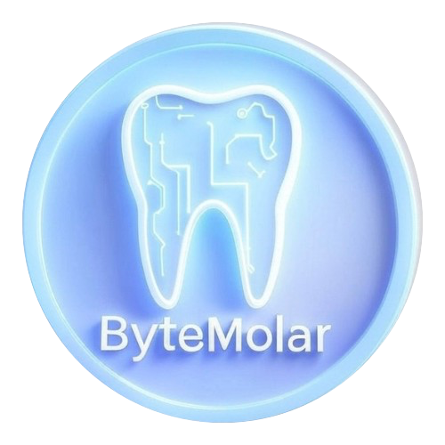

  

# ByteMolar: AI Dental Diagnostics Platform 🦷💡

*"Revolutionizing oral healthcare with cutting-edge AI and advanced technology."*

---

## **Introduction**
In a world where dental health is key to overall well-being, ByteMolar redefines the future of oral care. Combining AI-driven diagnostics with modern technology, ByteMolar stands at the intersection of innovation and patient care, offering unparalleled insights into dental health.

ByteMolar isn’t just a platform—it’s a commitment to enhancing dental outcomes for patients and professionals alike. With its robust tools and intelligent systems, ByteMolar empowers clinics to deliver faster, more accurate, and personalized dental care.

---

## **Why ByteMolar?**
Oral health impacts overall health. ByteMolar provides the tools to identify, manage, and optimize dental health outcomes with precision and care.

- **Revolutionizing Diagnostics**: ByteMolar leverages AI to analyze dental images and provide actionable insights.
- **Personalized Treatment Plans**: Tailored suggestions based on each patient’s unique dental needs.
- **Empowering Clinics**: From dashboards to analytics, ByteMolar enhances clinic efficiency and patient satisfaction.
- **Data Security and Privacy**: Fully compliant with HIPAA/GDPR to ensure patient trust.

---

## **Features**
1. **AI-Powered Image Recognition**
   Analyze dental X-rays and intraoral scans with unparalleled accuracy:
   - Detect cavities, fractures, and periodontal issues in real time.

2. **Predictive Outcome Modeling**
   Leverage historical data to forecast treatment success and patient outcomes:
   - Help patients make informed decisions with confidence.

3. **Dynamic Patient Portal**
   A secure hub for patients to:
   - Access dental records, treatment plans, and appointment schedules.

4. **Clinic Dashboard & Reporting**
   Advanced tools for clinics:
   - Monitor operational metrics, manage appointments, and visualize patient trends.

5. **Integration & APIs**
   Seamless compatibility with existing clinic management systems:
   - Enhance workflows without disruption.

---

## **Who is ByteMolar For?**
ByteMolar is designed for:

- **Dentists**: Streamline diagnostics and improve patient outcomes.
- **Clinics**: Increase efficiency, reduce costs, and enhance patient experiences.
- **Patients**: Gain a deeper understanding of their oral health through transparent tools.

---

## **How ByteMolar Improves Lives**

1. Faster, More Accurate Diagnoses:
   - Reduce waiting times and improve diagnostic precision with AI-powered tools.

2. Enhanced Patient Experience:
   - Empower patients with insights into their oral health and treatment plans.

3. Improved Operational Efficiency:
   - Optimize clinic workflows and reduce administrative burdens.

---

## **Experience ByteMolar**

1. **Explore the Technology**:
   - Dive into the AI-powered diagnostic features and discover how ByteMolar transforms oral healthcare.

2. **Engage with the Platform**:
   - Use the intuitive dashboard, patient portal, and advanced reporting tools.

3. **Transform Dental Care**:
   - Harness the power of AI to redefine your clinic's approach to oral health.

---

## **Contributing to ByteMolar**

Join the ByteMolar community to shape the future of dental diagnostics. Collaborate with experts, share insights, and expand the platform's impact on global oral health.

---

License

This project is licensed under the MIT License.

Explore, innovate, and transform dental healthcare with ByteMolar—because oral health matters.

